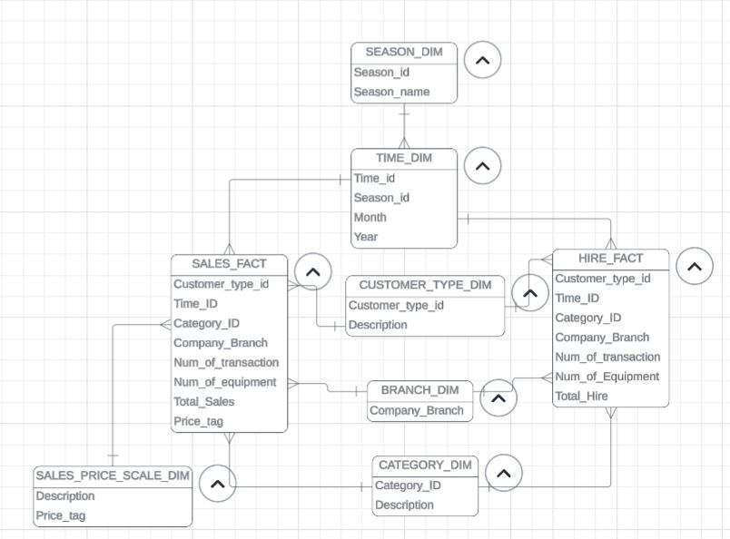

# Equipment Sales and Hire Data Warehouse

## Project Overview
This project implements star schema data warehouse for equipment sales and rental analytics using SQL, through data cleaning, data modelling, with the aim to extract business insights.

## Technologies 
- SQL
- Data Warehouse (Star Schema)
- Dimensional Modelling
- Data Cleaning and Transformation

## Data Warehouse Design
The star schema consists of two fact tables and dimension tables: 
### Fact Tables
- SALES_FACT : stores the aggregated sales metrics
- HIRE_FACT : stores the aggregated hire metrics

### Dimension Tables
- TIME_DIM  
- SEASON_DIM  
- CATEGORY_DIM  
- CUSTOMER_TYPE_DIM  
- BRANCH_DIM  
- SALES_PRICE_SCALE_DIM

## Star Schema 
The diagram of the star schema can be found below

## Key Findings
- Clayton branch generated the highest revenue ($2.77M) and 93 units sold.
- Equipment hire demand peaks during cooler seasons (Spring and Winter).
- Sales revenue shows a steady increasing trend.
- Business customers hire more frequently and in larger quantities than individuals.
- Trailers are the most frequently hired equipment type.
  
## Additional Notes
The dataset was sourced from a University Oracle database and is not publicly available.

